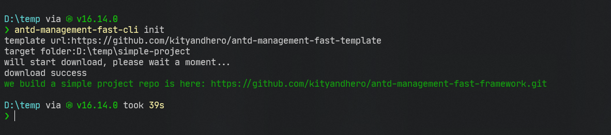

# `antd-management-fast-cli`

> Tantd-management-fast-cli is terminal tools. it can create management system fast from repo template.

## Install

```bash
npm install -g antd-management-fast-cli
```

## Usage

```bash
antd-management-fast-cli init
```

### Screenshot

[](cli.png)
